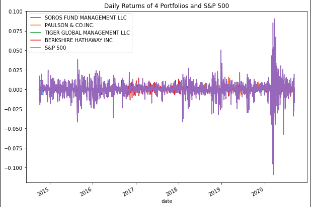
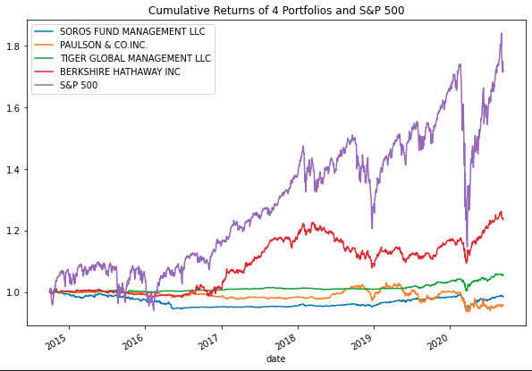
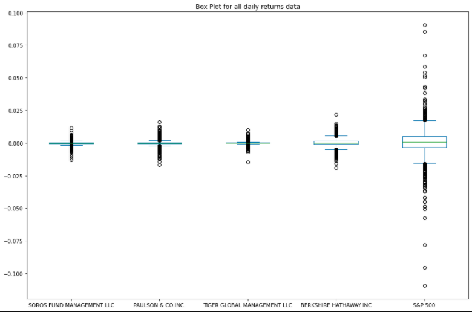
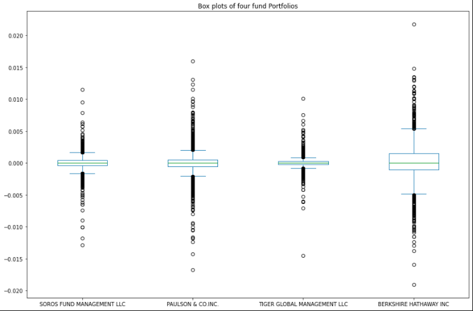
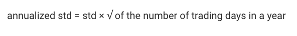
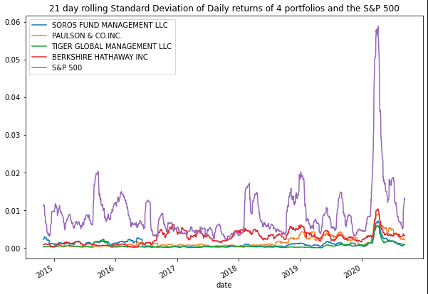
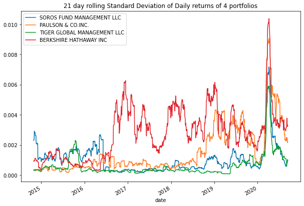
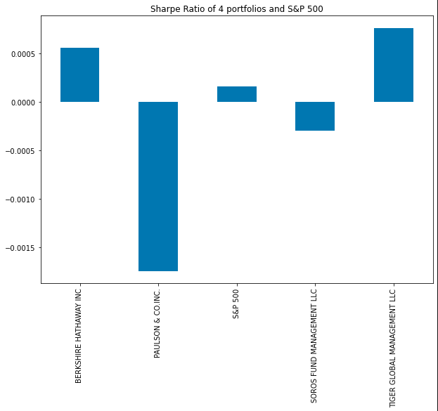
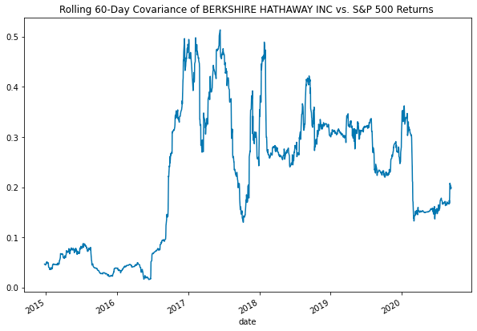
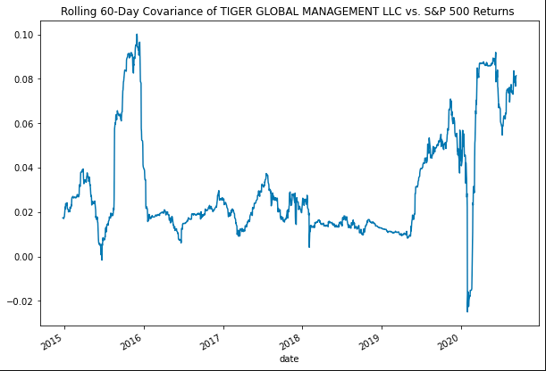

# Investment_Portfolio_Betterment
This application evaluates four new investment options for adding in a client's retirement portfolio based on key risk-management metrics: the daily returns, standard deviations, Sharpe ratios, and betas.

---

## Technologies

This application works on python 3.7 and uses following libraries:

* [matplotlib](https://github.com/matplotlib/matplotlib.git) - For creating static, animated, and interactive visualizations.

* [numpy](https://numpy.org/doc/stable/) - Numpy is a Python library that provides fundamental package for scientific computing in Python.

---


## Installation Guide

Follow the following instructions before using the application.

```python
  pip install numpy
  pip install -U matplotlib
```
---

## Detailed Explanation

Investment evaluation consists of following steps:

1. ### Data Import
  1. Investment profile dataframe `whale_navs_csv` is created using he Pandas `read_csv` function and the `Path` module by importing the data from `whale_navs.csv` file. The `date` column is set as index column.
  2. `daily_returns` dataframe for all four portfolios and S&P500 based on `whale_navs_csv` is created using `pct_change` function laong with `dropna` function to remove missing values.

2. ### Performance Analysis
The data is analyzed to determine if any of the portfolios outperform S&P 500. To do so below steps are followed. 
  1. Using the default Pandas `plot` function to visualize the daily return data of the four fund portfolios and the S&P 500. 
  

  2. Using the Pandas `cumprod` function to calculate the cumulative returns for the four fund portfolios and the S&P 500.

  3. Using the default Pandas `plot` to visualize the cumulative return values for the four funds and the S&P 500 over time.
  

---

  >Question : Based on the cumulative return data and the visualization, do any of the four fund portfolios outperform the S&P 500 Index?
  
  >Answer : During the initial time period there are some times where cumulative returns for S&P 500 is lower than most of the other fund portfolios but over the time S&P 500 outperforms all other four fund portfolios even during the dip in early 2019 and early 2020.
  
---

3. ### Volatility Analysis
Box plot is used to analyse the volatility of four fund portfolio and S&P 500.
 1.  Using the Pandas `plot` function to visualize the daily return data for each of the four portfolios and for the S&P 500 in a box plot.
 
 2. Box plot of four fund portfolio for closer examination.
 
 
---

  >Question : Based on the box plot visualization of just the four fund portfolios, which fund was the most volatile (with the greatest spread) and which was the least volatile (with the smallest spread)?
  
  > Answer : 
  
  >1. `BERKSHIRE HATHWAY INC` seems to be more volatile compared to other three portfolios with largest spread.
  >2. `TIGER GLOBAL MANAGEMENT LLC` seems to be least volatile with the smallest spread.
  
---

4. ###Risk Analysis
Risk Profile for each portfolio is built using Standard deviation ans the beta value.
  1. Using the Pandas `std` function the standard deviation for each of the four portfolios and for the S&P 500 is calculated.
  2. Annualized standard deviation for each of the four portfolio and S&P 500 is calculated using the formula
  
  3. A 21-day rolling standard deviation of daily returns Dataframe of four fund portfolio and the S&P 500 index is plotted.
  
  4. A 21-day rolling standard deviation of daily returns Dataframe of just the four fund portfolio is plotted.
  

---

  >Question : Based on the annualized standard deviation, which portfolios pose more risk than the S&P 500?
  
  > Answer : Compared to S&P 500 all other four fund portfolios seems to pose less risk than S&P 500.
  
  >Question : Based on the rolling metrics, does the risk of each portfolio increase at the same time that the risk of the S&P 500 increases?
  
  > Answer : 
  
  >1) During the inital years(2015-2016) the risk for the four funding portfolios doesnt' seem to be affected by S&P 500. The four portfolios seems to be stable even when there is a rise in S&P 500.
  >2) From the end of 2016 BERKSHIRE HATHAWAY INC risk increase when risk of S&P 500 increases while the other three porfolios seems to be stable.
  >3) From the end of 2018 PAULSON & CO.INC. risk increase when risk of S&P 500 increases while the other two porfolios seems to be stable.
  >4) From 2019 all the portfolios's risk seems to be affected when S&P 500 increases.
  >5) When there is very large increase risk of in S&P 500 during 2020 all the four portfolio's risk inreased significantly at that time.

  >In conclusion, BERKSHIRE HATHAWAY INC and PAULSON & CO.INC. risk increases when S&P risk increases. But when there is a very large significant increase in risk of S&P 500 it is reflected in all the portfolios.

  >Question : Based on the rolling standard deviations of only the four fund portfolios, which portfolio poses the most risk? Does this change over time?
  
  > Answer : BERKSHIRE HATHAWAY INC poses more risk and over time PAULSON & CO.INC. also seems to pose more risk.

---

5. ### Risk-Return Profile Analysis
Risk-Return profile of all the fund portfolio is determines using Sharpe Ratio.
  1. Calculate the annualized average return data for the four fund portfolios and for the S&P 500.
  2. Calculate the Sharpe ratios for the four fund portfolios and for the S&P 500
  3. Plot the Sharpe ratios for the four funds and for the S&P 500 in a bar chart.
  
  
---

  >Question : Which of the four portfolios offers the best risk-return profile? Which offers the worst?
  
  > Answer : 
  
  >1. Worst Risk-Return Portfolio - PAULSON & CO.INC. , SOROS FUND MANAGEMENT LLC 
  >2. Best Risk-Rturn Portfolio - BERKSHIRE HATHAWAY INC , TIGER GLOBAL MANAGEMENT LLC
  
---

5. ### Portfolio Diversification
we are choosing BERKSHIRE HATHAWAY INC , TIGER GLOBAL MANAGEMENT LLC portfolio for further analysis.
  1. The 60-day rolling varince of the S&P 500 is calculated using pandas `var` function.
  
  ---
  The below steps are followed for each of the selected portfolios.
  1. 60-day rolling Covariance of the portfolio is calculated using the daily returns data and the S&P 500 returns.
  2. Beta value of the profile is calculated by dividing the covariance of the portfolio with the variance of S&P 500.
  3. Average value of the 60-day rolling beta of the portfolio is calculated.
  4. 60-day rolling beta for each portfolio is visualised by plotting.
  
  
  
---

  >Question : Which of the two portfolios seem more sensitive to movements in the S&P 500?
  
  > Answer : TIGER GLOBAL MANAGEMENT LLC seem to be more sensitive to the movements in the S&P 500 compared to BERKSHIRE HATHAWAY INC
  
  >Question : Which of the two portfolios do you recommend for inclusion in your firm’s suite of fund offerings?
  
  > Answer : **BERKSHIRE HATHAWAY INC is recommended** for the inclusion based on the fact that its beta value is `0.2214986101354593` compared to TIGER GLOBAL MANAGEMENT LLC's beta value which is 0.03093001487238774.
  
---
